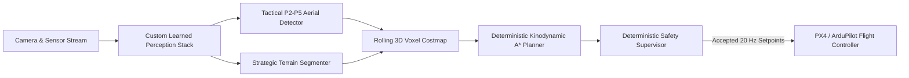

# SkyTech: UAV Autonomous Navigation & Perception Stack

SkyTech is a safety-critical autonomous aerial navigation perception and planning framework designed for In-Silico Software-In-The-Loop (SITL) digital twin environments and edge UAV deployments.

---

## 1. System Architecture



### Core Safety Principle
Learned perception operates **strictly as an observation and risk/obstacle proposal layer**. Neural networks never directly drive motors or declare unmapped regions safe. A deterministic safety supervisor verifies kinematic limits (speed, acceleration, jerk, geofence, clearance) before emitting 20 Hz MAVLink setpoints to the autopilot.

---

## 2. Model Architectures

### Strategic Terrain Segmenter (`src/models/terrain_segmenter.py`)
- **Parameters**: 2,357,526 trainable weights ($<6\text{M}$ budget).
- **Input**: $(B, 3, 512, 512)$ aerial tile.
- **Backbone**: Depthwise-separable inverted residual stages (P2=64, P3=128, P4=192, P5=256).
- **Context Block**: Multi-scale dilated depthwise convolutions at P4 (dilation rates $1, 2, 4, 8$).
- **Auxiliary Head**: Stride-4 Sobel boundary edge predictor for sharp building and road borders.
- **Loss**: Class-balanced Cross-Entropy + Soft Multiclass Dice + Boundary BCE.

### Tactical Aerial Object Detector (`src/models/tactical_detector.py`)
- **Input**: $(B, 3, 960, 960)$ letterboxed frame.
- **P2 Stride-4 Head**: Explicit high-resolution $240 \times 240$ feature stage designed specifically to preserve tiny aerial objects (median box area $0.046\%$).
- **Neck**: Bi-directional Feature Pyramid Network (BiFPN) fusing P2–P5.
- **Loss**: Quality Focal Loss (QFL) + Distribution Focal Loss (DFL) + Complete IoU (CIoU) with ignore-region masking.

---

## 3. Dataset Audit & Sanitization

1. **Dubai Aerial Segmentation**:
   - Fixed critical palette defect in `classes.json` (previously mismapped 99.49% of pixels).
   - Reconstructed 8 parent satellite scenes for leak-free 8-fold cross-validation.
2. **VisDrone 2019-DET**:
   - Quarantined 3 zero-area corrupt boxes; extracted 14,198 score-zero ignore regions.
   - Unified into standard 10-class tactical taxonomy.
3. **AU-AIR Multimodal UAV**:
   - Quarantined 54 non-positive area boxes; established clip-level splits preventing temporal 5 Hz leakage.
4. **OpenSky ADS-B Telemetry**:
   - Filtered stale reports ($>15\text{ s}$) and on-ground aircraft, generating 187 clean cooperative traffic trajectories.
5. **NASA C-MAPSS**:
   - Computed piecewise-linear RUL (clipped at 125 cycles) with zero-variance sensor pruning.

---

## 4. Repository Structure

```
├── src/
│   ├── models/
│   │   ├── terrain_segmenter.py      # Custom encoder-decoder architecture
│   │   └── export_onnx.py            # Static ONNX export engine
│   ├── data/
│   │   ├── segmentation_dataset.py   # RAM-cached Dubai dataset loader
│   │   └── detection_dataset.py      # Unified AU-AIR + VisDrone loader
│   ├── preprocessing/
│   │   ├── prepare_dubai.py          # Palette repair & 8-fold split generator
│   │   ├── prepare_visdrone.py       # Box quarantine & annotation converter
│   │   ├── prepare_auair.py          # UAV annotation parser & clip partitioner
│   │   ├── prepare_opensky.py        # ADS-B telemetry cleaner & track extractor
│   │   ├── prepare_cmapss.py         # RUL calculation & feature normalizer
│   │   └── visual_verification.py    # Automated contact sheet generator
│   └── training/
│       └── train_segmentation.py     # Training engine with streaming mIoU
├── data_processed/                   # Audit manifests & verification contact sheets
├── checkpoints/
│   └── terrain_segmenter_512.onnx    # Static ONNX engine (Opset 18)
├── test_dataloaders.py               # Automated smoke test suite
└── .gitignore                        # Raw datasets & binary exclusion
```

---

## 5. Quick Start

### Setup Environment
```bash
pip install torch torchvision numpy pillow opencv-python pyyaml tqdm onnx onnxscript
```

### Run Automated Data Smoke Tests
```bash
python test_dataloaders.py
```

### Train Strategic Terrain Segmenter
```bash
python src/training/train_segmentation.py --epochs 10 --batch_size 4 --crop_size 384 --fold 1
```

### Export to Static ONNX
```bash
python src/models/export_onnx.py
```
