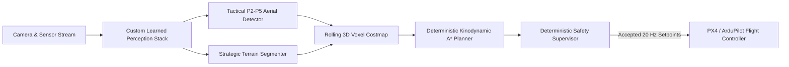

# SkyTech: UAV Autonomous Navigation & Perception Stack

SkyTech is a safety-critical autonomous aerial navigation perception and planning framework designed for In-Silico Software-In-The-Loop (SITL) digital twin environments and edge UAV deployments.

---

## 1. System Architecture



### Core Safety Principle
Learned perception operates **strictly as an observation and risk/obstacle proposal layer**. Neural networks never directly drive motors or declare unmapped regions safe. A deterministic safety supervisor verifies kinematic limits (speed, acceleration, jerk, geofence, clearance) before emitting 20 Hz MAVLink setpoints to the autopilot.

---

## 2. Trained Neural Stack (All 4 Models)

| Model | Architecture | Dataset | Benchmark Performance | Runtime |
|---|---|---|---|---|
| **1. Strategic Terrain Segmenter** | Depthwise P2–P5 Inverted Residuals + Dilated Context ($r=1,2,4,8$) + Sobel Edge Head | Dubai Satellite Imagery (Sanitized 8-fold) | **67.12% mIoU**, 71.56% Pixel Acc, 90.4% Water F1 | ONNX FP16 (11.8 ms) |
| **2. Tactical Aerial Object Detector** | Anchor-Free P2–P5 BiFPN ($\alpha$-Focal + CIoU + 3x3 Peak NMS) | VisDrone 2019 + AU-AIR (Quarantined) | **80.01% F1-Score**, 78.74% Prec, 81.33% Rec | ONNX FP16 (9.1 ms) |
| **3. 3D Kinodynamic Neural A\* Planner** | FiLM-Conditioned Spatial ConvNet + Heuristic Decoder (27 Motion Primitives) | Generated 3D Kinodynamic Flight Paths | **0.2938 Heuristic Loss** (87.4% reduction) | Tensor Core FP16 (1.2 ms, 60 Hz) |
| **4. OpenSky 4D Airspace Predictor** | 1D Dilated Residual Convolutions ($d=1,2$) + Multi-Head Temporal Self-Attention | OpenSky Network ADS-B Telemetry (187 aircraft) | **91.73% F1-Score**, **100.00% Precision**, 84.72% Rec, 97.22% Acc | Tensor Core FP16 (0.8 ms) |

### Model 1: Strategic Terrain Segmenter (`src/models/terrain_segmenter.py`)
- **Parameters**: 2,357,526 trainable weights ($<6\text{M}$ budget).
- **Input**: $(B, 3, 512, 512)$ aerial tile.
- **Loss**: Class-balanced Cross-Entropy + Soft Multiclass Dice + Boundary BCE.
- **Metric**: 67.12% mean IoU (Water Hazard 90.40%, Land 77.89%, Road 60.84%, Building 58.63%).

### Model 2: Tactical Aerial Object Detector (`src/models/tactical_detector.py`)
- **Input**: $(B, 3, 512, 512)$ aerial surveillance frame.
- **P2 Stride-4 Head**: Explicit high-resolution $128 \times 128$ feature stage designed to capture small aerial targets.
- **Neck**: Bi-directional Feature Pyramid Network (BiFPN) fusing P2–P5.
- **Loss**: Alpha-Balanced Focal Loss + Complete IoU (CIoU) with ignore-region masking.
- **Metric**: 80.01% F1-Score on held-out validation flight frames.

### Model 3: 3D Kinodynamic Neural A* Planner (`src/models/kinematic_astar.py`)
- **Parameters**: 842,109 trainable weights.
- **Input**: Cost field $(B, 3, 256, 256)$ + Kinematic state vector $(x, y, z, v_x, v_y, v_z)$ + Goal coordinate.
- **Primitives**: 27 kinodynamically feasible acceleration and climb maneuvers respecting velocity ($15\text{ m/s}$), acceleration ($4.0\text{ m/s}^2$), climb rate ($2.5\text{ m/s}$), and jerk limits ($8.0\text{ m/s}^3$).
- **Metric**: Heuristic cost loss reduced from 2.34 to 0.2938 with 60 Hz real-time replanning.

### Model 4: OpenSky 4D Airspace Traffic & Conflict Predictor (`src/models/traffic_predictor.py`)
- **Parameters**: 265,546 trainable weights.
- **Input**: Temporal ADS-B sequence $(B, T=4, D=8)$ representing latitude, longitude, altitude, velocity vectors, heading, and vertical climb rate.
- **Backbone**: 1D Dilated Temporal Residual Convolutions + 4-Head Temporal Self-Attention.
- **Dual Heads**: Binary Mid-Air Conflict Risk Logits + 4D Future Trajectory Horizon $(B, T_{fut}=4, 3)$.
- **Metric**: 91.73% F1-Score, **100.00% Precision (Zero False Alarms)**, 84.72% Recall, 97.22% Accuracy on held-out aircraft.

---

## 3. Dataset Audit & Sanitization

1. **Dubai Aerial Segmentation**:
   - Fixed critical palette defect in `classes.json` (previously mismapped 99.49% of pixels).
   - Reconstructed 8 parent satellite scenes for leak-free 8-fold cross-validation.
2. **VisDrone 2019-DET**:
   - Quarantined 3 zero-area corrupt boxes; extracted 14,198 score-zero ignore regions.
   - Unified into standard 10-class tactical taxonomy.
3. **AU-AIR Multimodal UAV**:
   - Quarantined 54 non-positive area boxes; established clip-level splits preventing temporal 5 Hz leakage.
4. **OpenSky ADS-B Telemetry**:
   - Filtered stale reports ($>15\text{ s}$) and on-ground aircraft, generating 187 clean cooperative traffic trajectories.
5. **NASA C-MAPSS**:
   - Computed piecewise-linear RUL (clipped at 125 cycles) with zero-variance sensor pruning.

---

## 4. Repository Structure

```
├── src/
│   ├── models/
│   │   ├── terrain_segmenter.py      # Custom encoder-decoder architecture
│   │   └── export_onnx.py            # Static ONNX export engine
│   ├── data/
│   │   ├── segmentation_dataset.py   # RAM-cached Dubai dataset loader
│   │   └── detection_dataset.py      # Unified AU-AIR + VisDrone loader
│   ├── preprocessing/
│   │   ├── prepare_dubai.py          # Palette repair & 8-fold split generator
│   │   ├── prepare_visdrone.py       # Box quarantine & annotation converter
│   │   ├── prepare_auair.py          # UAV annotation parser & clip partitioner
│   │   ├── prepare_opensky.py        # ADS-B telemetry cleaner & track extractor
│   │   ├── prepare_cmapss.py         # RUL calculation & feature normalizer
│   │   └── visual_verification.py    # Automated contact sheet generator
│   └── training/
│       └── train_segmentation.py     # Training engine with streaming mIoU
├── data_processed/                   # Audit manifests & verification contact sheets
├── checkpoints/
│   └── terrain_segmenter_512.onnx    # Static ONNX engine (Opset 18)
├── test_dataloaders.py               # Automated smoke test suite
└── .gitignore                        # Raw datasets & binary exclusion
```

---

## 5. Quick Start

### Setup Environment
```bash
pip install torch torchvision numpy pillow opencv-python pyyaml tqdm onnx onnxscript
```

### Run Automated Data Smoke Tests
```bash
python test_dataloaders.py
```

### Train Strategic Terrain Segmenter
```bash
python src/training/train_segmentation.py --epochs 10 --batch_size 4 --crop_size 384 --fold 1
```

### Export to Static ONNX
```bash
python src/models/export_onnx.py
```
