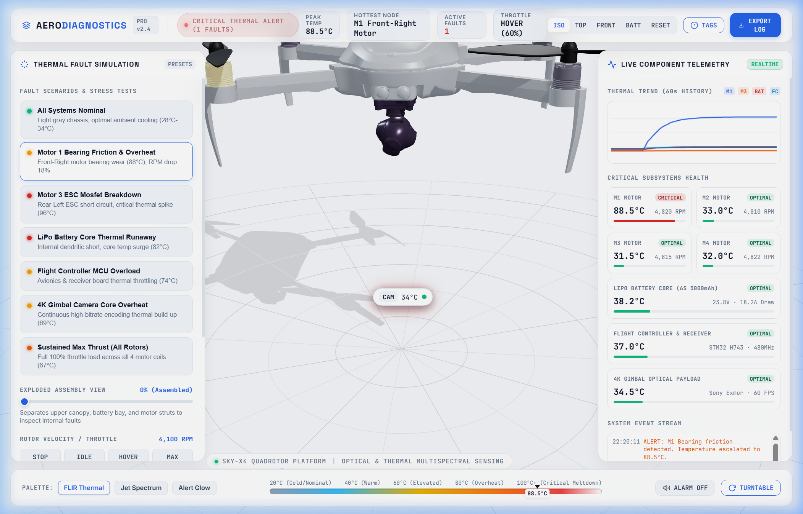

# UAV AeroDiagnostics - 3D Thermal Heatmap & Fault Simulation

A precision 3D UAV aerospace simulation featuring a **premium studio white background**, an industrial **light gray satin finish** drone model, and a real-time **multispectral thermal heatmap engine** designed to simulate and diagnose component faults, electrical shorts, and thermal runaway.



---

## Key Features

1. **Premium Studio White Environment**:
   - Ultra-clean `#f8fafc` to `#ffffff` background with studio contact shadows, soft hemispheric lighting, and an engineering polar radar grid.
   - Apple/Tesla/DJI aerospace aesthetic with frosted glass telemetry panels (`backdrop-filter: blur(18px)`), crisp dark typography (`Space Grotesk`, `Inter`, `JetBrains Mono`), and minimal status pills.

2. **Pristine Light Gray Drone Design (`gray_drone.glb`)**:
   - Standalone 3D model with 77 distinct aerospace subcomponents (`motor_1..4`, `battery`, `receiver` flight controller, `camera` 4K gimbal, chassis frames, and landing legs).
   - All materials baked into an immaculate industrial light gray satin PBR finish (`#d2d7df` / `#e2e8f0` with roughness `0.38` and metalness `0.24`), accented by dark carbon rotor blades and camera lens details.

3. **Dynamic Multispectral Thermal Heatmap Engine**:
   - Real-time heat dissipation and vertex/material temperature modulation ($20^\circ\text{C}$ to $110^\circ\text{C}$).
   - **Three Color Palettes**:
     - **FLIR Thermal (Ironbow)**: Dark Violet $\rightarrow$ Vivid Magenta $\rightarrow$ Warm Orange $\rightarrow$ Solar Yellow $\rightarrow$ Incandescent White.
     - **Jet Spectrum**: Scientific cold-to-hot spectrum (Light Gray $\rightarrow$ Cyan $\rightarrow$ Green $\rightarrow$ Yellow $\rightarrow$ Red $\rightarrow$ White).
     - **Alert Glow**: Clean light gray body with bright pulsing neon warning halos on overheated subsystems.
   - Emissive thermal bloom & pulsing warning animations on critical overheating components ($>75^\circ\text{C}$).

4. **One-Click Fault Scenarios & Stress Tests**:
   - **Nominal Flight Profile**: Balanced optimal cooling ($28^\circ\text{C} - 34^\circ\text{C}$).
   - **Motor 1 Bearing Friction & Overheat**: Front-Right motor reaches $88.5^\circ\text{C}$, RPM drops 18%.
   - **Motor 3 ESC Mosfet Breakdown**: Rear-Left ESC short circuit spikes to $96.2^\circ\text{C}$ (Critical Overheat).
   - **LiPo Battery Core Thermal Runaway**: Dendritic core surge reaches $82.5^\circ\text{C}$ with cell voltage warnings.
   - **Flight Controller MCU Overload**: Dual-core avionics processor thermal throttling ($74.8^\circ\text{C}$).
   - **4K Gimbal Camera Core Overheat**: Sustained high-bitrate video encoder heating ($69.2^\circ\text{C}$).
   - **Sustained Max Thrust Test**: 100% full-throttle load heating all propulsion stators ($67.5^\circ\text{C}$).

5. **Advanced Interactive Controls**:
   - **Exploded Assembly View**: Smooth interactive slider that expands the canopy, battery bay, and motor struts apart to inspect internal electronics.
   - **3D Floating Pinned Badges**: Real-time HUD badges anchored in 3D world space over each critical subsystem.
   - **Click-to-Inspect Modal**: Click any component in 3D space to pull up telemetry, root-cause analysis (RCA), safe operating limits, and maintenance recommendations.
   - **Rolling 60s Thermal History**: Real-time canvas sparkline tracking temperatures over time.
   - **Acoustic Warning Synthesizer**: Web Audio API dual-tone alert on thermal thresholds.
   - **Camera Presets**: Isometric Studio 3D, Top-Down 2D Schematic, Front Elevation, Battery Core Focus.

---

## Quick Start

```bash
# Navigate to the simulation directory
cd thermal-simulation

# Install dependencies (Three.js)
npm install

# Start the local simulation server
node server.js
```

Open your browser and navigate to:
```
http://localhost:3001
```

---

## File Structure

- `gray_drone.glb`: Standalone separated 3D GLTF binary model with light gray satin PBR finish.
- `create_gray_glb.py`: Script used to parse, colorize, and generate `gray_drone.glb`.
- `index.html`: Main HTML5 application shell and glassmorphic HUD.
- `styles.css`: Studio white design system, responsive glass panels, and thermal gradients.
- `app.js`: Three.js engine, GLTFLoader, thermal shaders, raycaster, animation mixer, and telemetry charts.
- `server.js`: Static Node.js HTTP server supporting `.glb`, `.mjs`, and `.png` assets on port 3001.
- `source/`: Original source models including `fly.glb` and `gray_drone.glb`.
- `textures/`: High-resolution PBR surface maps and channels.
